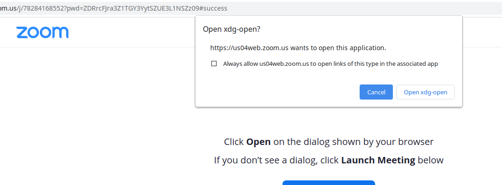
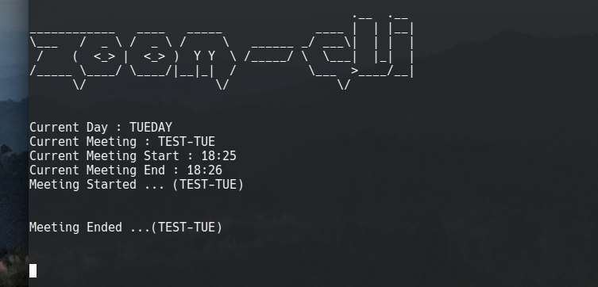

# Zoom Auto Join
### 1st condition : don't expect too much


If you want to keep your PC on and keep yourself busy with another task (or maybe sleeping) and you don't wanna miss any meetings to join, this repo is for you.

## Step 1 : Do some stuffs
* Auto Mute while joining meeting (From Settings)
* Auto Turn Off video while joining meeting (From Settings)
* Auto join audio (From Settings)
* Allow Zoom App to open link always (Mark the Checkbox). This will automatically open the Zoom App. (Picture below)



## Step 2 : Clone this repo
```sh
git clone git@github.com:buetcse17/Zoom-Meetings-Auto-Join.git
```

## Step 3
#### (Only for the first time) 
Open terminal
```sh
pip3 install virtualenv
virtualenv myenv
source myenv/bin/activate
pip install -r requirements.txt
deactivate
chmod +x zoom-cli.sh
```
## Step 4
Done. Now everytime you just have to run the .sh file only
```sh
./zoom-cli.sh
```



If there is any zoom meeting available in the list of data.py, then the meetings will be opened automatically in time.
### Note :
The meetings links I'm using are most probably correct. Make your modifications while necessary (it is not automatically updated). And here is a while loop used which has a pause of 30sec to reduce unnecessary continuous running , so there can be a 30sec late of joining meetings.
This script won't automatically leave meetings (as it can be unexpected/dangerous).

#### Run this script on a terminal on background and don't use this tab while this is running. 
